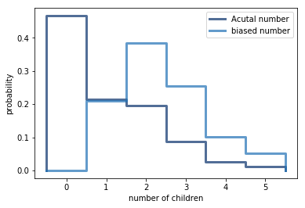

[Think Stats Chapter 3 Exercise 1](http://greenteapress.com/thinkstats2/html/thinkstats2004.html#toc31) (actual vs. biased)

>> Actual mean: 1.0242051550438309  
>> Biased mean: 2.4036791006642821  

>> Clearly surveying children affects the mean and the sample distribution



```python
resp = nsfg.ReadFemResp()

actualData = thinkstats2.Pmf(resp.numkdhh, label='Acutal number')
biasedData = BiasPmf(hist, label='biased number')
thinkplot.Pmfs([actualData, biasedData])
thinkplot.Config(xlabel='number of children', ylabel='probability')

actualData.Mean()  
biasedData.Mean()

```
