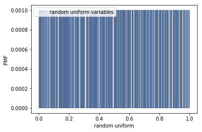
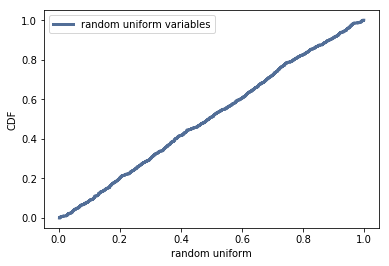

[Think Stats Chapter 4 Exercise 2](http://greenteapress.com/thinkstats2/html/thinkstats2005.html#toc41) (a random distribution)

>> The PMF is not perfectly uniform.  We cannot perfectly represent the distribution with a finite number of samples.

